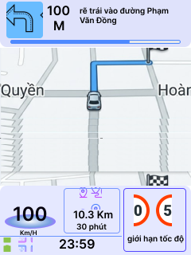

# ESP-IDF Nordic UART Service (NUS)

Project nay bien ESP32 thanh BLE GATT server tuong thich Nordic UART Service
(NUS). Lop `nus.c/nus.h` quan ly BLE stack, advertising, trang thai ket noi,
notify, timeout, RX callback va TX queue. File `gatts_demo.c` chi con la vi du
ung dung su dung wrapper NUS.

| Supported Targets | ESP32 | ESP32-C2 | ESP32-C3 | ESP32-C5 | ESP32-C6 | ESP32-C61 | ESP32-H2 | ESP32-S3 |
| ----------------- | ----- | -------- | -------- | -------- | -------- | --------- | -------- | -------- |

## NUS UUID

Service va characteristic dung UUID NUS chuan:

| Name | UUID | Direction |
| ---- | ---- | --------- |
| NUS Service | `6E400001-B5A3-F393-E0A9-E50E24DCCA9E` | BLE service |
| NUS RX | `6E400002-B5A3-F393-E0A9-E50E24DCCA9E` | Phone/app write vao ESP |
| NUS TX | `6E400003-B5A3-F393-E0A9-E50E24DCCA9E` | ESP notify len phone/app |

## File Chinh

- `main/nus.h`: public API cho app.
- `main/nus.c`: BLE GATT server, advertising, connection state, TX queue,
  timeout va callback noi bo.
- `main/nus_protocol.h`: public API cho frame protocol, parser, packer va
  callbacks.
- `main/nus_protocol.c`: CRC-16/MCRF4XX, streaming parser, command dispatcher,
  ACK/response helper va payload codec.
- `main/gatts_demo.c`: vi du khoi tao NUS, noi RX vao protocol dispatcher va
  dang ky callbacks.
- `main/CMakeLists.txt`: build `gatts_demo.c`, `nus.c` va `nus_protocol.c`.

## Build

Trong ESP-IDF terminal:

```bash
idf.py set-target esp32h2
idf.py build
idf.py -p COM8 flash monitor
```

Neu PowerShell tren Windows bi chon sai Python ESP-IDF, co the dung:

```powershell
$env:PATH = 'C:\Espressif\tools\idf-python\3.11.2;' + $env:PATH
. C:\Espressif\frameworks\esp-idf-v5.5.3\export.ps1
$env:IDF_TARGET='esp32h2'
idf.py build
```

## Su Dung Nhan Va Gui

Du lieu phone/app gui xuong ESP se vao RX callback:

```c
static void app_nus_rx_cb(const uint8_t *data, uint16_t len)
{
    ESP_LOG_BUFFER_HEX("APP", data, len);

    // Gui lai du lieu vua nhan qua NUS TX notify.
    esp_err_t err = nus_send(data, len, pdMS_TO_TICKS(100));
    if (err != ESP_OK) {
        ESP_LOGW("APP", "nus_send failed: %s", esp_err_to_name(err));
    }
}
```

De gui du lieu tu ESP len phone/app:

```c
const uint8_t msg[] = "hello";
esp_err_t err = nus_send(msg, sizeof(msg) - 1, pdMS_TO_TICKS(100));
```

`nus_send()` khong gui truc tiep trong BLE callback. Ham nay dua data vao
FreeRTOS queue, task `nus_tx` se tu cat goi theo MTU va gui notification. Client
phai connect va enable notify tren NUS TX thi ham moi tra `ESP_OK`.

## Cau Hinh NUS

Cau hinh nam trong `nus_config_t`:

```c
void app_main(void)
{
    nus_config_t config = NUS_CONFIG_DEFAULT();

    config.device_name = "Tiem NUS";
    config.adv_interval_min_ms = 80;
    config.adv_interval_max_ms = 120;
    config.adv_timeout_ms = 0;       // 0 = advertising khong tu stop

    config.conn_interval_min_ms = 20;
    config.conn_interval_max_ms = 40;
    config.conn_latency = 0;
    config.conn_timeout_ms = 4000;

    config.idle_timeout_ms = 0;      // 0 = khong tu disconnect khi idle
    config.auto_start_adv = true;
    config.restart_adv_after_disconnect = true;

    nus_set_state_callback(app_nus_state_cb);
    ESP_ERROR_CHECK(nus_init_with_config(&config, app_nus_rx_cb));
}
```

Neu khong can tuy bien:

```c
ESP_ERROR_CHECK(nus_init(app_nus_rx_cb));
```

## Advertising

Advertising co the tu start sau init bang `auto_start_adv = true`, hoac dieu
khien thu cong:

```c
nus_start_adv(30000); // start advertising va tu stop sau 30 giay
nus_stop_adv();       // stop advertising thu cong
```

API lien quan:

```c
bool nus_is_advertising(void);
esp_err_t nus_start_adv(uint32_t timeout_ms);
esp_err_t nus_stop_adv(void);
```

`timeout_ms = 0` nghia la khong dat timeout advertising.

## Timeout

Co hai timeout rieng:

- `adv_timeout_ms`: neu dang advertising ma chua co client connect, NUS tu stop
  advertising sau thoi gian nay.
- `idle_timeout_ms`: neu da connect ma khong co RX/TX trong thoi gian nay, NUS
  phat event `NUS_STATE_IDLE_TIMEOUT` va disconnect client.

Khi app co activity rieng ma muon reset idle timer:

```c
nus_reset_idle_timeout();
```

## State Callback

Dang ky state callback de theo doi trang thai:

```c
static void app_nus_state_cb(nus_state_event_t event)
{
    switch (event) {
    case NUS_STATE_ADV_STARTED:
        break;
    case NUS_STATE_ADV_STOPPED:
        break;
    case NUS_STATE_ADV_TIMEOUT:
        break;
    case NUS_STATE_CONNECTED:
        break;
    case NUS_STATE_DISCONNECTED:
        break;
    case NUS_STATE_NOTIFY_ENABLED:
        break;
    case NUS_STATE_NOTIFY_DISABLED:
        break;
    case NUS_STATE_IDLE_TIMEOUT:
        break;
    default:
        break;
    }
}
```

## API Tom Tat

```c
esp_err_t nus_init(nus_rx_cb_t rx_cb);
esp_err_t nus_init_with_config(const nus_config_t *config, nus_rx_cb_t rx_cb);

void nus_set_rx_callback(nus_rx_cb_t rx_cb);
void nus_set_state_callback(nus_state_cb_t state_cb);

bool nus_is_connected(void);
bool nus_is_advertising(void);
bool nus_is_notify_enabled(void);
uint16_t nus_get_mtu(void);
uint16_t nus_get_max_payload_len(void);

esp_err_t nus_start_adv(uint32_t timeout_ms);
esp_err_t nus_stop_adv(void);
esp_err_t nus_send(const uint8_t *data, uint16_t len, TickType_t ticks_to_wait);
void nus_flush_tx_queue(void);
void nus_reset_idle_timeout(void);
```

## Gioi Han Mac Dinh

- `NUS_MAX_DATA_LEN = 500`
- `NUS_TX_QUEUE_LEN = 10`
- MTU local duoc set la 500.
- Payload notify thuc te moi goi la `MTU - 3`.
- Neu data lon hon payload notify, `nus_tx` tu cat thanh nhieu notification.

## Test Bang Dien Thoai

Co the dung app BLE bat ky co ho tro Nordic UART Service, vi du Nordic nRF
Connect:

1. Scan device name `Tiem NUS`.
2. Connect vao device.
3. Enable notification cho characteristic NUS TX.
4. Write data vao characteristic NUS RX.
5. Demo hien tai parse frame protocol, goi callback tuong ung va tra ACK hoac
   response qua NUS TX.


## NUS Protocol

Protocol nam tren NUS RX/TX va duoc xu ly trong `nus_protocol.c`. Parser la
streaming parser, nen co the nhan frame bi chia nho theo BLE write hoac nhieu
frame trong cung mot lan RX.

Frame:

```text
SOF(0xAC) | CMD(1) | TYPE(1) | LEN(2 LE) | PAYLOAD | CRC16/MCRF4XX(2 LE)
```

CRC tinh tren tat ca byte tu `SOF` den het `PAYLOAD`, khong tinh 2 byte CRC.
Gioi han frame hien tai la `NUS_MAX_DATA_LEN` byte, payload toi da la
`NUS_PROTOCOL_MAX_PAYLOAD_LEN` byte.

### Type

| Type | Value |
| ---- | ----- |
| `REQUEST` | `0x00` |
| `RESPONSE` | `0x01` |
| `EVENT` | `0x02` |
| `COMMAND` | `0x03` |
| `ACK` | `0x04` |

ACK payload co 1 byte status:

| Status | Value |
| ------ | ----- |
| `OK` | `0x00` |
| `INVALID_FRAME` | `0x01` |
| `INVALID_TYPE` | `0x02` |
| `INVALID_PAYLOAD` | `0x03` |
| `UNSUPPORTED_CMD` | `0x04` |
| `APP_ERROR` | `0x05` |
| `TX_FAILED` | `0x06` |

### Commands

| CMD | Type từ mobile | Payload | Reply |
| --- | -------------- | ------- | ----- |
| `NAV_INSTRUCTION_TEXT (0x01)` | `EVENT` | xem bên dưới | `ACK` |
| `NAV_INSTRUCTION_IMAGE (0x02)` | `EVENT` | xem bên dưới | `ACK` |
| `TRAFFIC_SIGN (0x03)` | `EVENT` | `u8 sign_type` · `u16 data_len` · `u8[] data` (string) | `ACK` |
| `DEVICE_INFO (0x04)` | `REQUEST` | rỗng | `RESPONSE` xem bên dưới |
| `CURRENT_TIME (0x05)` | `EVENT` | `u32 epoch_seconds` little-endian | `ACK` |
| `FILE_TRANSFER (0x06)` | `COMMAND` | `u32 file_size` · `u32 offset` · `u16 data_len` · `u8[] data` | `ACK` |
| `OTA (0x07)` | `REQUEST`/`EVENT`/`COMMAND` | raw, TBD | `ACK` |
| `MAP_LINES (0x08)` | `EVENT` | xem phần [Viewport-clipped map lines](#viewport-clipped-map-lines--hud-map_lines) | `ACK` |

---

### NAV_INSTRUCTION_TEXT (0x01) — payload chi tiết

Gửi mỗi khi maneuver thay đổi hoặc khoảng cách cập nhật đáng kể.
Tất cả số nguyên là little-endian. Trường text là UTF-8, tối đa 64 byte, có thể
strip dấu nếu firmware báo không hỗ trợ (qua `capBitmap` trong DEVICE_INFO).

```
u8       direction_len          // byte length của direction_text (0–64)
u8[]     direction_text         // hướng rẽ hiện tại, vd "Rẽ trái"

u8       4                      // luôn = 4 (length prefix cố định cho u32)
u32      distance_to_maneuver_m // khoảng cách tới điểm rẽ (m)

u8       next_len               // byte length của next_direction_text
u8[]     next_direction_text    // hướng rẽ tiếp theo

u8       4
u32      destination_distance_m // tổng khoảng cách còn lại tới đích (m)

u8       4
u32      remaining_time_minutes // thời gian còn lại (phút)

u16      current_speed_mps      // tốc độ hiện tại (m/s), KHÔNG có length prefix

u8       4
u32      epoch_seconds          // Unix time UTC tại thời điểm gửi
```

### NAV_INSTRUCTION_IMAGE (0x02) — payload chi tiết

Gửi khi maneuver type thay đổi (coalesced, bỏ qua nếu type giống lần trước).
Hiện tại fixed 24×24 px RGB565 (maneuver icon), firmware vẽ lên HUD.

```
u8       format      // 0x01=RGB565, 0x02=RGB888, 0x03=MONO1
u16      width       // pixel, little-endian (hiện tại = 24)
u16      height      // pixel, little-endian (hiện tại = 24)
u16      data_len    // byte length của data
u8[]     data        // raw pixel data theo format trên
```

Với RGB565 24×24: `data_len = 24 × 24 × 2 = 1152 byte` → gửi 5 BLE write
chunk (MTU 247 byte).

### DEVICE_INFO (0x04) — response payload

```
u32      hardware_version
u32      firmware_version
u8[16]   manufacturer_id    // ASCII, null-padded
u8[32]   serial_number      // ASCII, null-padded
u32      product_id
u32      model_id           // dùng để tra HudDisplayConfig cho MAP_LINES
```

Tổng: 4+4+16+32+4+4 = **64 byte**.

Mobile đọc `model_id` → tra bảng `_hudDisplayConfigs` → biết `map_w × map_h`
để dùng cho projection trong `MAP_LINES`.

## Viewport-clipped map lines → HUD (MAP_LINES)

### Ý tưởng

ESP32 display chỉ có một vùng nhỏ dành cho mini-map (hiện tại 240×180 px trong
layout 240×320). Thay vì gửi ảnh bitmap (tốn bandwidth BLE), mobile gửi **dữ
liệu vector** — danh sách tọa độ pixel của các đoạn line — để ESP32 tự vẽ.

Mobile thực hiện toàn bộ phần nặng:
1. Clip route geometry theo viewport camera hiện tại.
2. Crop viewport về đúng tỉ lệ của ESP32 display (center-crop).
3. Project lat/lng → pixel (u8 x, u8 y) trong không gian display.
4. Đóng gói và gửi qua `MAP_LINES (0x08)`.

ESP32 nhận list điểm → vẽ đường nối các điểm liên tiếp trong mỗi polyline.

---

### Device pairing — đọc model → suy ra kích thước display

Ngay khi BLE pair thành công, mobile gửi `DEVICE_INFO(0x04) REQUEST`. ESP32
trả về response chứa trường `model (uint32_t)`. Mobile tra bảng để biết:

- Kích thước toàn bộ display (`screen_w × screen_h`)
- Vùng dành riêng cho mini-map (`map_w × map_h`) — phần layout còn lại sau
  khi firmware đã dùng cho speedometer, maneuver icon, v.v.

```dart
// Bảng model → display config (mở rộng khi thêm hardware mới)
const _hudDisplayConfigs = {
  0x0001: HudDisplayConfig(screenW: 240, screenH: 320, mapW: 240, mapH: 180),
  0x0002: HudDisplayConfig(screenW: 320, screenH: 240, mapW: 200, mapH: 160),
  // ...
};

void onDeviceInfoReceived(DeviceInfo info) {
  final config = _hudDisplayConfigs[info.model]
      ?? HudDisplayConfig(screenW: 240, screenH: 320, mapW: 240, mapH: 180); // fallback
  _bleBridge?.setHudDisplayConfig(config);
}
```

`HudDisplayConfig` được lưu trong `BleBridge` và dùng cho mọi lần tính crop
ratio + pixel projection về sau. Không cần user config thủ công.

---

### Mobile side (Flutter)

#### 1. Lấy viewport và center-crop theo tỉ lệ target

```
target_ratio = display_w / display_h   // ví dụ 240/180 = 4/3

viewport = controller.getVisibleRegion()  // LatLngBounds (lat/lng)

// Tính span hiện tại
lng_span = east - west
lat_span = north - south

// Center-crop chiều dọc để khớp tỉ lệ
lat_span_cropped = lng_span / target_ratio * (lat_per_lng_scale)
// (scale do lat/lng không đều nhau — dùng cos(lat) để điều chỉnh)

center_lat = (north + south) / 2
north_crop = center_lat + lat_span_cropped / 2
south_crop = center_lat - lat_span_cropped / 2
```

Kết quả: một `LatLngBounds` mới (west, south_crop, east, north_crop) có đúng
tỉ lệ 4:3 (hoặc bất kỳ tỉ lệ nào của display target).

#### 2. Clip route geometry vào cropped bounds

Duyệt từng segment của `remaining` (và tuyến phụ), chỉ giữ điểm trong bounds
+ 1 điểm buffer ngoài mỗi đầu để line không bị cụt đột ngột tại viền màn hình.

#### 3. Project lat/lng → pixel (u8)

```
x = round((lng - west)  / (east  - west)  * (display_w - 1))   // 0..display_w-1
y = round((north - lat) / (north - south) * (display_h - 1))   // 0..display_h-1
// y đảo chiều: north → y=0 (top), south → y=max (bottom)
```

`display_w=240` và `display_h=180` đều < 256 → dùng `u8` vừa đủ.
Màn hình tương lai lớn hơn (ví dụ 320×240): vẫn dùng `u8` vì
protocol normalize về không gian display, không phải pixel tuyệt đối.

#### 4. Trigger gửi

Gửi sau khi camera settle (debounce ~400 ms sau `_onCameraMove`) và sau mỗi
lần route progress cập nhật đáng kể (> ~10 m). Không gửi nếu BLE chưa kết nối.

---

### Protocol — MAP_LINES (0x08)

Frame wrapper giữ nguyên: `SOF | CMD | TYPE | LEN | PAYLOAD | CRC16/MCRF4XX`.

**Payload:**

```
u8   line_count              // số polyline trong gói (thường 1–3)

// Lặp lại line_count lần:
u8   line_type               // 0x01=route chính còn lại, 0x02=tuyến phụ,
                             // 0x03=đoạn đã đi (mờ)
u8   point_count             // số điểm của polyline này
u8[] points                  // point_count × 2 byte: x0,y0, x1,y1, ...
```

Ví dụ gói 1 polyline chính 8 điểm + 1 tuyến phụ 5 điểm:

```
01                           // line_count = 2  (sai ví dụ, sửa:)
02
  01  08  x0 y0 x1 y1 ... x7 y7    // route chính, 8 điểm
  02  05  x0 y0 x1 y1 x2 y2 x3 y3 x4 y4  // tuyến phụ, 5 điểm
```

Tổng byte ví dụ: `1 + (1+1+16) + (1+1+10)` = **31 byte** — nhỏ hơn 1 MTU BLE.

**Giới hạn:** `point_count` tối đa 60 điểm/polyline để payload luôn nằm trong
1 BLE write chunk (247 byte MTU) với tối đa 3 polyline.

---

### ESP32 side (firmware)

#### Parser

Khi `CMD == 0x08`, đọc `line_count` rồi loop:

```c
void map_lines_handler(const uint8_t *payload, uint16_t len) {
    uint16_t i = 0;
    uint8_t line_count = payload[i++];

    display_clear_map_region();  // xóa vùng mini-map trước khi vẽ lại

    for (uint8_t l = 0; l < line_count; l++) {
        uint8_t line_type   = payload[i++];
        uint8_t point_count = payload[i++];

        for (uint8_t p = 1; p < point_count; p++) {
            uint8_t x0 = payload[i + (p-1)*2];
            uint8_t y0 = payload[i + (p-1)*2 + 1];
            uint8_t x1 = payload[i + p*2];
            uint8_t y1 = payload[i + p*2 + 1];
            display_draw_line(x0, y0, x1, y1, line_type);
        }
        i += point_count * 2;
    }
    ack_status(ACK_OK);
}
```

#### Vẽ theo line_type

| `line_type` | Style gợi ý |
|-------------|-------------|
| `0x01` route chính | nét đậm, màu primary (xanh) |
| `0x02` tuyến phụ  | nét mảnh, màu xám / mờ |
| `0x03` đã đi      | nét mảnh, màu xám đậm hơn |

`display_draw_line` dùng Bresenham line algorithm (có sẵn trong hầu hết
TFT driver như `ili9341`, `st7789`).

---
### Protocol API

Khoi tao dispatcher:

```c
static nus_protocol_t s_protocol;

static esp_err_t proto_send(const uint8_t *data,
                            uint16_t len,
                            TickType_t ticks_to_wait,
                            void *user_ctx)
{
    return nus_send(data, len, ticks_to_wait);
}

nus_protocol_config_t proto_config = NUS_PROTOCOL_CONFIG_DEFAULT(proto_send, NULL);
proto_config.tx_wait_ticks = 0; // non-blocking ACK/response inside BLE RX callback
const nus_protocol_callbacks_t callbacks = {
    .on_nav_instruction = app_proto_nav_instruction_cb,
    .on_device_info_request = app_proto_device_info_cb,
    .on_current_time = app_proto_current_time_cb,
    .on_unknown = app_proto_unknown_cb,
};

ESP_ERROR_CHECK(nus_protocol_init(&s_protocol, &proto_config, &callbacks));
```

Noi BLE RX vao parser:

```c
static void app_nus_rx_cb(const uint8_t *data, uint16_t len)
{
    ESP_ERROR_CHECK(nus_protocol_input(&s_protocol, data, len));
}
```

Gui frame thu cong khi can:

```c
nus_protocol_send_ack(&s_protocol, NUS_PROTO_CMD_CURRENT_TIME, NUS_PROTO_STATUS_OK);
nus_protocol_send_frame(&s_protocol, cmd, NUS_PROTO_TYPE_EVENT, payload, payload_len);
```

De mo rong command moi, them enum CMD, payload parser/packer neu can, them entry
vao `s_dispatch_table` trong `nus_protocol.c`, sau do them callback vao
`nus_protocol_callbacks_t`.


# Device information 
  - FW version 2 bytes  uint16_t (major *10000 + minor *100 + build)
  - harware version 2 bytes  uint16_t (major *10000 + minor *100 + build)
  - manufacture id 2 bytes  uint16_t  (0xAAAA)
  - product ID 2 bytes (0x0001)
  - model ID 2 bytes (0x0001)
  - serial number (32 bytes ASCII) ()
  - Date 10 bytes (build time)
  

# Device config 
 - day/ night mode 
 - brightness
 - TBD

# model ID 
## NUS 
## es32
## screens ST7789 240x320

1. thư viện LVGL
   
2. layout 



- khung topbar (W 240 x  H 59) vị trí x =0 , y =0 ; 
	- ảnh rẽ hướng  (khung ảnh + ảnh 46x46) vị trí x =8 , y =2 . ảnh được gửi từ điện thoại 

    - khoảng cách rẽ  cỡ 20 vị trí x =57 , y =4 ;
	thôn tin bổ sung rẽ  text cỡ 12 , khung 136x40 , vị trí x = 104, y =8
	-  process bar quãng đường đã đi W 214 x H 5 , vị trí x = 13 , y =50 
- khung Main:  240x180 vị trí x = 0 ; y = 55 (topbar đè lên main 4 pixel)
	- ảnh map chỉ đường được gửi từ điện thoại

	

- Bottom bar: 240x87, vị trí x = 0 , y = 233
    - bảng tốc độ (ảnh (64x18) + text speed (size 24, vị trí 16, 250 (hiện ở center ảnh)) + text "Km/H" size 8, vị trí 25, 283)
	- bảng hiển thị quãng đường còn lại và thười gian còn lại để đến đích (icon 28x28, vị trí 100, 235 + text quãng đường (size 13 vị trí 92,261 )+ text thời gian (size 10, vị trí 96, 278) ) 
	- bảng cảnh báo ảnh ( khung viền 80x80, vị trí 155,236
	cảnh báo text (size 10, 160x293), cảnh báo ảnh (48x48) 
	- icon pin battery (18x18 vị trí 3 ,298) + icon connection (18x18, vị trí 23, 298) + giờ hiện tại (size 18 , vị trí 74 298) . icon được lưu trong flash 


